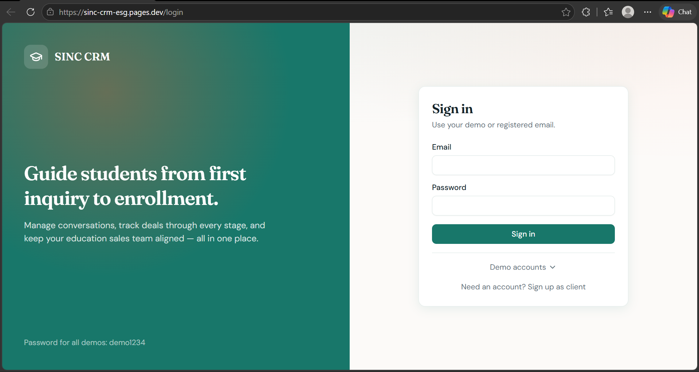
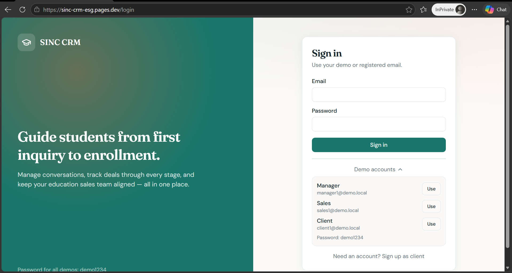
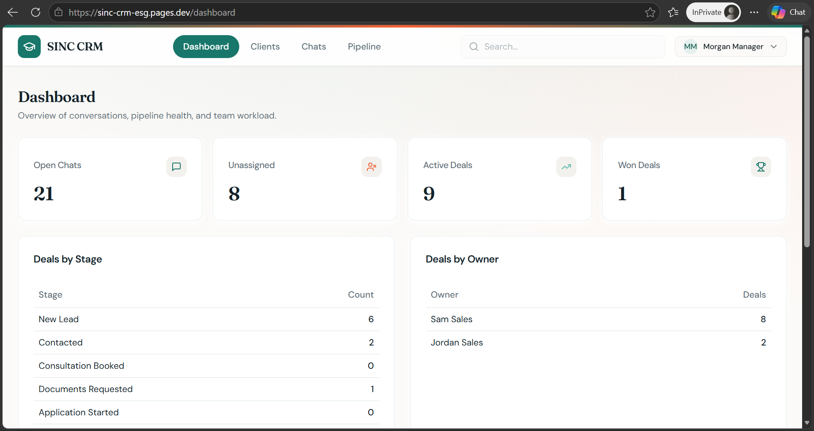
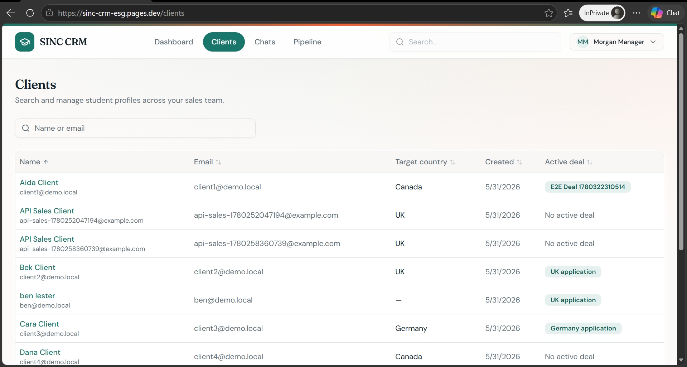
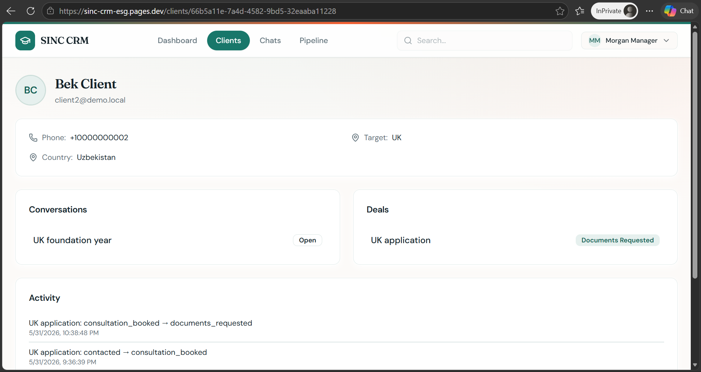
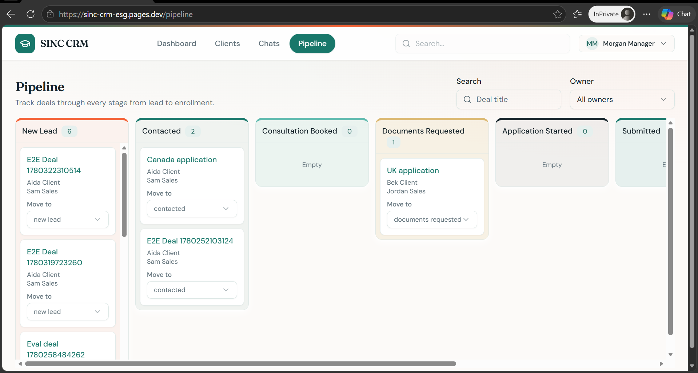
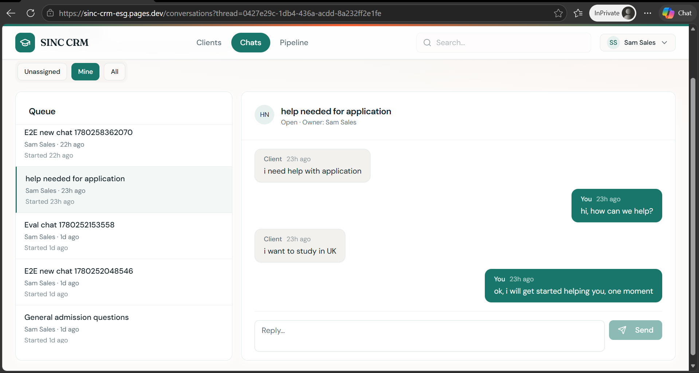
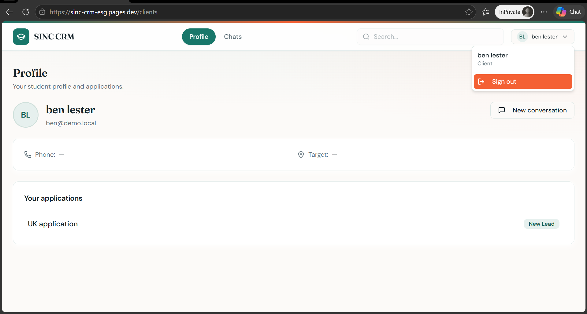
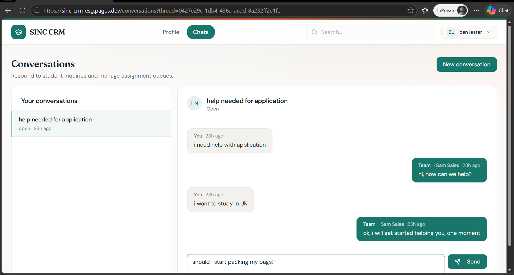

# SINC Student CRM

A full-stack student CRM with role-based access, realtime chat, deal pipeline, and a manager dashboard. The SPA runs on Cloudflare Pages (Vite + React); the API runs on Cloudflare Workers (Hono); data and auth use hosted Supabase.

## Screenshots

| Login | 
|-------|
|  |  

| Demo accounts |  
|---------------|  
 |  

**Manager** — dashboard, clients, client detail, pipeline:

| Dashboard |  
|-----------|  
|  |  

| Clients |  
|---------|
|  |  

| Client detail |  
|---------------|  
|  |  

| Pipeline |  
|----------|  
|  |  

**Sales** — conversation workspace:



**Client** — profile and chat:

| Profile |  
|---------|  
|  |  

| Chat |
|------|
 |

## Quick start

**Canonical guide:** [docs/quick-start.md](docs/quick-start.md) — automated setup (Linux/WSL), env files, hosted Supabase schema/seed, and local dev servers.

## Live application

The deployed instance is available for hands-on testing in production. Sign in with any [demo user](#demo-users) below (password **`demo1234`**).  
You can also use the signup form to create a demo account(email verification is disabled to ease running tests)

| Service | URL |
|---------|-----|
| App (Cloudflare Pages) | [https://sinc-crm-esg.pages.dev](https://sinc-crm-esg.pages.dev) (stable project domain — see [deploy-guide](docs/deploy-guide.md#pages-url-stable-vs-deployment-preview-read-before-pass-2)) |
| API (Cloudflare Worker) | [https://sinc-crm-api.prinxlexter.workers.dev](https://sinc-crm-api.prinxlexter.workers.dev) |
| Supabase (dashboard) | [https://fgoqijltbhkrztxjebjm.supabase.co](https://fgoqijltbhkrztxjebjm.supabase.co) |

## Demo users

Password for all seeded accounts: **`demo1234`** (override with `SEED_DEMO_PASSWORD` when seeding).

| Role | Email | Display name | Notes |
|------|-------|--------------|-------|
| Manager | `manager1@demo.local` | Morgan Manager | Dashboard, full nav |
| Manager | `manager2@demo.local` | Alex Manager | Same role capabilities |
| Sales | `sales1@demo.local` | Sam Sales | Clients, conversations, pipeline |
| Sales | `sales2@demo.local` | Jordan Sales | Clients, conversations, pipeline |
| Sales | `sales3@demo.local` | Riley Sales | Clients, conversations, pipeline |
| Client | `client1@demo.local` | Aida Client | Assigned thread + deal (`new_lead`) |
| Client | `client2@demo.local` | Bek Client | Assigned thread + deal (`contacted`) |
| Client | `client3@demo.local` | Cara Client | Assigned thread + deal (`consultation_booked`) |
| Client | `client4@demo.local` | Dana Client | Unassigned queue thread, no deal |

CRM-only row without auth login: `prospect.no.login@example.com` — see [database-setup.md — Seed composition](docs/database-setup.md#6-seed-composition-your-requirements).

## Running tests

Run **`npm run test:e2e`** for the full isolated Playwright suite (creates a temporary Supabase project, seeds, tests, deletes — 60 tests total). For day-to-day dev against your existing `.env`, use **`npm run test:e2e:dev`**. Worker unit tests: **`npm run test:worker`**.

Full catalog, commands, and how to add tests: [docs/testing-guide.md](docs/testing-guide.md#back-to-readme). Tooling auth ladder: `npm run test:scripts`.

## Releases

| Tag | Notes |
|-----|-------|
| **v1.4.0** (latest) | Single root `.env`, RLS security hardening, isolated E2E, script/verify refactor, manager RBAC |
| v1.3.0 | Pre–infra-overhaul baseline — use if v1.4.0 setup surprises you |

```bash
git checkout v1.4.0   # latest release (recommended)
git checkout v1.3.0   # known-stable fallback before major code overhaul
```

## Documentation

| Topic | Quick link |
|-------|------------|
| **API reference (OpenAPI)** | [docs/api/openapi.yaml](docs/api/openapi.yaml) · [interactive viewer](docs/api/index.html) |
| Quick start (install, env, scripts) | [docs/quick-start.md](docs/quick-start.md#back-to-readme) |
| **Script reference (setup / verify)** | [docs/script-reference.md](docs/script-reference.md) |
| Database schema & seed | [docs/database-setup.md](docs/database-setup.md#back-to-readme) |
| **Security (RLS, keys, threat model)** | [docs/security-architecture.md](docs/security-architecture.md) |
| Tooling auth (Cloudflare / Supabase / GitHub) | [docs/external-auth.md](docs/external-auth.md#back-to-readme) |
| **How to work on the codebase** | [docs/development-guide.md](docs/development-guide.md#back-to-readme) |
| Testing (all tests + how to add) | [docs/testing-guide.md](docs/testing-guide.md#back-to-readme) |
| Full project guide | [docs/project-guide.md](docs/project-guide.md#back-to-readme) |
| Roadmap & future work | [docs/roadmap.md](docs/roadmap.md#back-to-readme) |
| Deployment | [docs/deploy-guide.md](docs/deploy-guide.md#back-to-readme) |
| All docs index | [docs/README.md](docs/README.md) |

## Requirements

Product specs live in [`project_requirements/`](project_requirements/) (architecture, database, acceptance criteria).

## Future work

Post-MVP improvements and deferred items: [docs/roadmap.md](docs/roadmap.md#back-to-readme).

## Deployment

**Canonical guide:** [docs/deploy-guide.md](docs/deploy-guide.md) — `npm run deploy:all` (automated two-pass) or manual Worker + Pages steps.

To reset Supabase data or schema **without deleting the supabase project** (fast dev iteration), see [database-setup.md — Reset database](docs/database-setup.md#reset-database-without-deleting-the-project).
