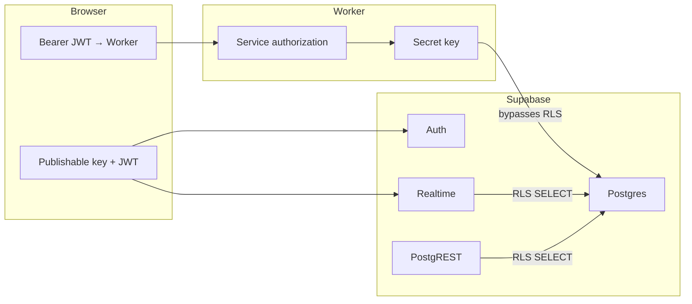

# Security architecture

This document explains how this CRM protects data at the database boundary, why Row Level Security (RLS) is used the way it is, and how to defend the architecture in reviews. It complements [database-setup.md](./database-setup.md) (operational setup) and [api/authentication.md](./api/authentication.md) (token flow).

---

## Threat model (what we assume)

| Asset | Exposure |
|-------|----------|
| Publishable Supabase key | In every browser bundle (`VITE_SUPABASE_PUBLISHABLE_KEY`) — treat as public |
| User access JWT | In browser storage and network requests — can be copied from DevTools |
| Secret Supabase key | Worker + local scripts only — must never reach the client |
| Worker API | Public HTTPS; authorization per route |

**Realistic attacker:** someone with the publishable key, optionally a stolen user JWT, probing PostgREST (`/rest/v1/...`), Realtime, Auth signup, and the documented Worker REST API.

**Out of scope for RLS:** compromise of the secret key, Worker code bugs, or social access to the Supabase Dashboard.

---

## Design principle: split authorization layers

We deliberately use **two layers**, each with a clear job:



| Path | Mechanism | RLS applies? |
|------|-----------|--------------|
| CRM reads/writes | Cloudflare Worker + `SUPABASE_SECRET_KEY` | No — service role bypasses RLS |
| Login / session | Supabase Auth + publishable key | N/A |
| Live UI updates | Realtime + publishable key + user JWT | Yes — `SELECT` policies |
| Direct PostgREST from UI | Not used for CRM data today | Would apply if added |

**Why not RLS-only?** Realtime and any future direct client reads need database-enforced row scope. **Why not Worker-only?** Realtime CDC does not go through the Worker; without RLS, subscribers could receive other tenants’ change events.

**Why not expose PostgREST for CRM reads?** Valid alternative for smaller apps; we chose Worker-first for consistent API shape, validation, and a single authorization story for mutations. RLS remains defense-in-depth and powers Realtime.

Canonical SQL: [`supabase/schema/`](../supabase/schema/) — especially `05_rls_realtime.sql`, `04_profile_bootstrap.sql`, `00_rls_auto_enable.sql`.

---

## Row Level Security in this project

### What RLS does

When RLS is enabled on a table, Postgres applies policies before returning or modifying rows. With RLS on and **no matching policy**, access is **denied by default**.

Our CRM tables have **SELECT-only** policies for the `authenticated` role. There are **no** INSERT/UPDATE/DELETE policies — even a valid JWT cannot mutate CRM rows via PostgREST.

### Where policies live

| Table | Policy | Scope |
|-------|--------|-------|
| `profiles` | `profiles_select_own` | Own row; managers see all |
| `clients` | `clients_select_scoped` | Sales/manager: all; client: own |
| `conversation_threads` | `conversation_threads_select_scoped` | Via `private.can_access_thread()` |
| `conversation_messages` | `conversation_messages_select_scoped` | Parent thread must be accessible |
| `deals` | `deals_select_scoped` | Via `private.can_access_deal()` |
| `deal_stage_history`, `deal_notes` | scoped variants | Parent deal must be accessible |

Access rules mirror the Worker services (`worker/src/services/*`) and [project_requirements/database.md](../project_requirements/database.md).

### Private schema helpers (RPC hardening)

RLS policies call helper functions (`current_app_role`, `can_access_thread`, etc.). These **must not** be callable as public RPC endpoints (`/rest/v1/rpc/...`).

**Decision:** helpers live in the **`private` schema**, which is not exposed to the Data API. The `authenticated` role retains `EXECUTE` so policies and Realtime still work; `anon` and `PUBLIC` do not.

Workers **never call** these functions — they use the secret key and query tables directly.

`public.handle_new_user()` is trigger-only: `REVOKE EXECUTE` from `anon` and `authenticated` so it cannot be invoked via RPC.

### Auto-enable RLS on new tables

[`00_rls_auto_enable.sql`](../supabase/schema/00_rls_auto_enable.sql) installs a Postgres event trigger that runs `ALTER TABLE ... ENABLE ROW LEVEL SECURITY` on every new table in `public`. This is defense-in-depth when adding tables via SQL; existing tables are still explicitly enabled in `05_rls_realtime.sql`.

New tables with RLS on but **no policies** are locked down (safe, but unusable until policies are added).

---

## Role assignment (signup hardening)

**Problem:** Supabase `user_metadata` is user-editable on public `signUp()`. A trigger that copied `user_metadata.role` into `profiles.role` allowed privilege escalation to `manager` without the secret key.

**Decision:**

- **`profiles.role` on signup** comes from `raw_app_meta_data.role` only, default **`client`**.
- Public browser signup sets display name in `user_metadata` only — not role.
- **`sales` / `manager`** are assigned via:
  - Admin API seed (`npm run db:seed` passes `app_metadata.role`), or
  - Supabase Dashboard (Table Editor / SQL on `profiles`).

GoTrue persists `app_metadata` in a **follow-up UPDATE** after `auth.users` INSERT, so `handle_new_user` (INSERT trigger) defaults role to `client`. `handle_user_app_metadata_updated` (UPDATE trigger) applies `raw_app_meta_data.role` when Admin API or Dashboard sets it — this is the intended path for seed and invites.

---

## Attack scenarios (publishable key in DevTools)

### A — Publishable key only (no user JWT)

PostgREST and Realtime run as `anon`. Policies target `authenticated` only → **no CRM rows**.

### B — Publishable key + legitimate client JWT

Direct `GET /rest/v1/deals?select=*` returns **only that client’s deals** (same scope as Realtime). Writes via PostgREST are blocked (no mutation policies).

Worker `/api/*` with the same JWT: secret-key client bypasses RLS, but services enforce role and ownership.

### C — Forged signup metadata (mitigated)

`signUp({ options: { data: { role: 'manager' } } })` no longer elevates `profiles.role` — role stays `client` unless `app_metadata` is set (Admin API only).

### D — Secret key leak

Full database access; RLS irrelevant. Keep `SUPABASE_SECRET_KEY` in Worker secrets and local env only.

---

## What we explicitly do not rely on

| Item | Notes |
|------|-------|
| RLS for Worker writes | Worker uses service role; authorization is in TypeScript services |
| `user_metadata` for authorization | Display only; role from `app_metadata` / DB |
| Email verification (demo) | Disabled on purpose — see [roadmap.md](./roadmap.md) |
| Hiding the publishable key | It is public by design; RLS + Auth bound its power |

---

## Reset / teardown implications

Level B CRM teardown must remove **private schema** objects as well as `public` CRM objects. See [database-setup.md — Level B](./database-setup.md#level-b--crm-schema-teardown-re-run-dbschema--dbseed):

- Drop event trigger `ensure_rls`
- Drop functions in `private` (RLS helpers + `rls_auto_enable`)
- Drop `private` schema if empty

After teardown, `npm run db:schema` reapplies `00` … `06` in order.

---

## Verification checklist

After schema changes:

```bash
npm run verify:supabase
```

Supabase Dashboard → **Database** → **Security Advisor** — confirm RPC warnings for public `SECURITY DEFINER` helpers are cleared.

Manual spot-checks:

1. Login as `client1@demo.local` — Realtime updates on own threads/deals only.
2. Optional: `curl` PostgREST with publishable key + client JWT — scoped rows only.
3. Optional: attempt `signUp` with `role: manager` in `user_metadata` — profile role remains `client`.

---

## Related docs

- [database-setup.md](./database-setup.md) — apply schema, seed, reset levels A/B
- [api/authentication.md](./api/authentication.md) — Bearer token flow
- [project_requirements/database.md](../project_requirements/database.md) — entity model and access rules
- [Supabase: Row Level Security](https://supabase.com/docs/guides/database/postgres/row-level-security)
