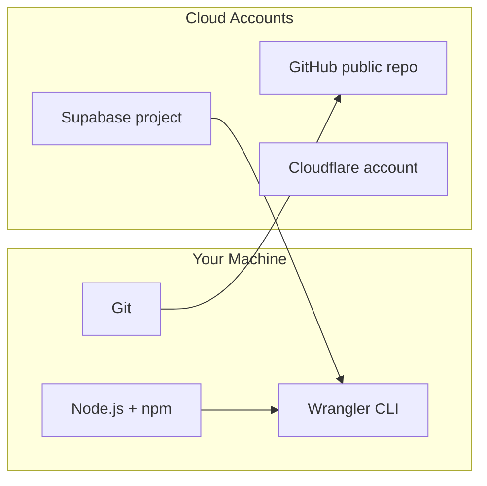

# Stack Setup Guide — Student CRM

Everything you need **installed locally** and **provisioned in the cloud** before building the app. Check items off as you go, then run the verification tests at the bottom.

Related: [project_requirements/README.md](../project_requirements/README.md), [my project summary.md](../my%20project%20summary.md)

---

## Setup checklist (check off as you go)

### Phase 1 — Local tools

- [ ] **Node.js 22+** installed (Wrangler 4.95 requires `node >= 22` — check with `node -v`)
- [ ] **npm** available (`npm -v`)
- [ ] **Git** installed (`git --version`)
- [ ] **Wrangler CLI** available for Cloudflare Workers
- [ ] **Supabase CLI** available for migrations and seeds (planned)
- [ ] Run stack verification for local tools (see §7)

### Phase 2 — Cloud accounts

- [ ] **GitHub** account; public repo created or forked (no write access to template repo)
- [ ] **Supabase** project created at [supabase.com](https://supabase.com)
- [ ] **Cloudflare** account created at [dash.cloudflare.com](https://dash.cloudflare.com)
- [ ] `wrangler login` completed
- [ ] Run: `npm run verify:stack:cloudflare` — logged in

### Phase 3 — Environment files (local secrets, not committed)

- [ ] Copy `.env.example` → `.env` (when added)
- [ ] Copy `worker/.dev.vars.example` → `worker/.dev.vars` (when worker package exists)
- [ ] Fill `VITE_SUPABASE_URL`, `VITE_SUPABASE_ANON_KEY` from Supabase → Settings → API
- [ ] Fill `SUPABASE_SERVICE_ROLE_KEY` only in `worker/.dev.vars` (never commit)
- [ ] Run: `npm run verify:stack:env` — required variables present

### Phase 4 — Supabase configuration

- [ ] SQL schema + indexes applied ([database.md](../project_requirements/database.md))
- [ ] **Auth** — Email provider enabled; Site URL includes `http://localhost:5173`
- [ ] **Realtime** — replication enabled for chat and deal tables
- [ ] **Profiles bootstrap** — `profiles` row on signup with role
- [ ] **Seed data** + demo users (client, sales, manager)
- [ ] Run: `npm run verify:stack:supabase` — API reachable and core tables exist

### Phase 5 — Repository & scaffold

- [ ] Git remote `origin` points to your public GitHub repo
- [ ] Vite + React frontend scaffolded
- [ ] Hono Worker scaffolded under `worker/`
- [ ] Run: `npm run verify:stack:scaffold`

### Phase 6 — Deploy & submission

- [ ] Worker and Pages deployed; README lists live URLs
- [ ] Video demo and form submission complete
- [ ] Run: `npm run verify:stack:deploy`

---

## Architecture overview



---

## 1. Local machine (WSL2/Linux)

### Node.js 22+

| | |
|---|---|
| **Why** | Wrangler 4.x requires Node 22+. |
| **How** | [nodejs.org](https://nodejs.org/) or nvm: `nvm install 22 && nvm use 22`. |

### Git

| | |
|---|---|
| **Why** | Public repo, readable commits, deploy hooks. |
| **How** | `git --version` |

---

## 2. Cloud accounts (free tiers)

See [project_requirements/README.md](../project_requirements/README.md) for GitHub, Supabase, and Cloudflare.

---

## 3. Environment variables

Document in candidate README: `VITE_SUPABASE_URL`, `VITE_SUPABASE_ANON_KEY`, `VITE_API_BASE_URL`, and Worker secrets (`SUPABASE_SERVICE_ROLE_KEY`).

---

## 4. Suggested order

1. Local tools — Node 22+, Git, CLIs  
2. Cloud accounts  
3. Supabase schema, Auth, Realtime, seeds  
4. Scaffold frontend + Worker  
5. Deploy and submit  

---

## 5. Verification tests

Phased verification scripts will be added under `scripts/`. Start with:

```bash
npm run verify:stack:local
```

---

## 6. Cost

| Provider | MVP |
|----------|-----|
| Supabase Free | $0 |
| Cloudflare Free | $0 |
| GitHub public | $0 |
