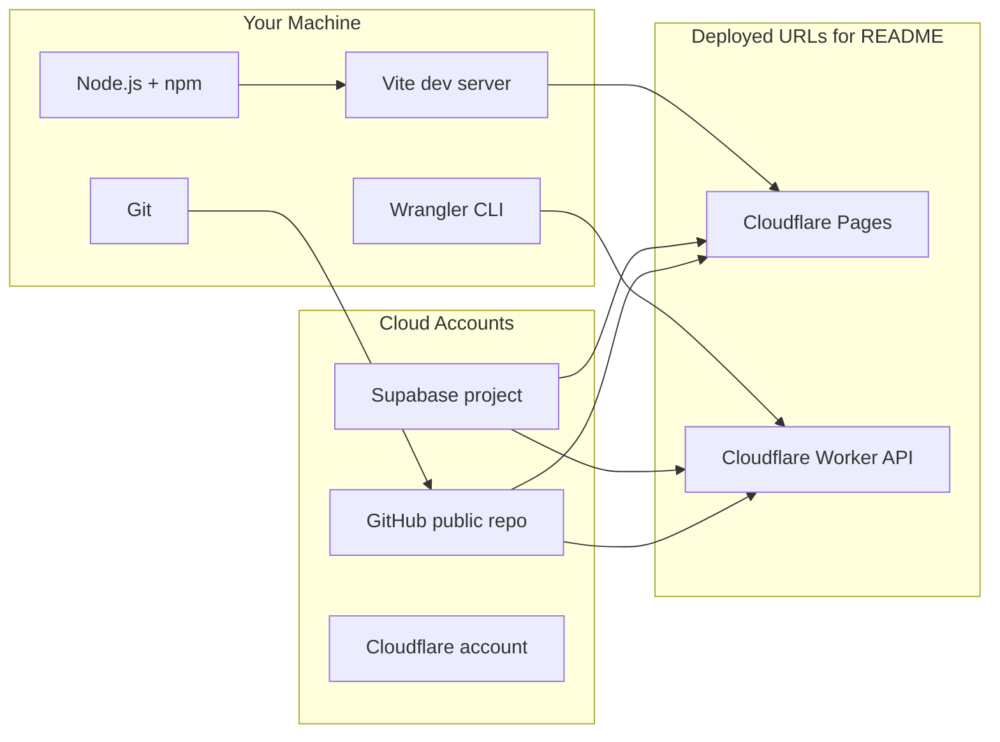

# Stack Setup Guide — Student CRM

Everything you need **installed locally** and **provisioned in the cloud** before building the app. Check items off as you go, then run the verification tests at the bottom.

Related: [project_requirements/README.md](../project_requirements/README.md), [my project summary.md](../my%20project%20summary.md)

---

## Setup checklist (check off as you go)

Copy this list into your notes or tick boxes here in the editor.

### Phase 1 — Local tools (complete)

- [x] **Node.js 22+** installed (required by Wrangler 4.95 — `node -v` shows v22+)
- [x] **npm** available (`npm -v`)
- [x] **Git** installed (`git --version`)
- [x] Run **`npm run install:linux`** (WSL/Linux) or follow [quick-start.md](./quick-start.md) on Windows
- [x] Run: `npm run verify:stack:local` — all checks pass

After `install:linux`, **restart the terminal** or run `source ~/.bashrc` so nvm loads in new sessions — see [quick-start.md](./quick-start.md).

### Phase 2 — Cloud accounts

- [ ] **GitHub** account; public repo created or forked (no write access to template repo)
- [ ] **Supabase** project created at [supabase.com](https://supabase.com)
- [ ] **Cloudflare** account created at [dash.cloudflare.com](https://dash.cloudflare.com)
- [ ] `wrangler login` completed
- [ ] Run: `npm run verify:stack:cloudflare` — logged in

### Phase 3 — Environment files (local secrets, not committed)

- [ ] Copy [.env.example](../.env.example) → `.env` (frontend / shared)
- [ ] Copy [worker/.dev.vars.example](../worker/.dev.vars.example) → `worker/.dev.vars` when worker exists (or create `worker/` first)
- [ ] Fill `VITE_SUPABASE_URL`, `VITE_SUPABASE_ANON_KEY` from Supabase → Settings → API
- [ ] Fill `SUPABASE_SERVICE_ROLE_KEY` only in `worker/.dev.vars` (never in `.env` committed to git)
- [ ] Run: `npm run verify:stack:env` — required variables present

### Phase 4 — Supabase configuration

- [ ] SQL schema + indexes applied ([database.md](../project_requirements/database.md) or [my project summary.md](../my%20project%20summary.md) §3)
- [ ] **Auth** — Email provider enabled; Site URL includes `http://localhost:5173` (add production URL after deploy)
- [ ] **Realtime** — replication enabled for: `conversation_messages`, `conversation_threads`, `deals`, `deal_stage_history`, `deal_notes`
- [ ] **Profiles bootstrap** — trigger or flow so new auth users get a `profiles` row with role
- [ ] **Seed data** + three demo users (client, sales, manager) with known passwords
- [ ] Run: `npm run verify:stack:supabase` — API reachable and core tables exist

### Phase 5 — Repository & scaffold (next build step)

- [ ] Git remote `origin` points to your public GitHub repo
- [ ] Vite + React frontend scaffolded
- [ ] Hono Worker scaffolded under `worker/`
- [ ] Run: `npm run verify:stack:scaffold` — expected folders/files exist

### Phase 6 — Deploy & submission (later)

- [ ] Worker deployed; `VITE_API_BASE_URL` set to production Worker URL
- [ ] Cloudflare Pages deployed; Supabase Auth redirect URLs updated
- [ ] Candidate README: setup, env vars, migrations, seeds, demo users, **both live URLs**
- [ ] Video demo recorded; Google Form submitted; review meeting booked
- [ ] Run: `npm run verify:stack:deploy` — production API responds (when URLs are set)

### Run everything applicable now

```bash
npm run verify:stack
```

---

## Architecture overview



---

## 1. Local machine (WSL2/Linux)

### Node.js 22+

| | |
|---|---|
| **Why** | Wrangler 4.95 requires `node >= 22`. Also runs Vite, React, and all npm tooling. |
| **How** | `npm run install:linux` (WSL/Linux), or [quick-start.md](./quick-start.md) on Windows. |

### Project-local CLIs (not global)

| | |
|---|---|
| **Why** | Pinned versions in repo; same setup for you and reviewers. |
| **How** | `npm run install:linux` or `npm run setup:local` installs **wrangler@4.95.0** in `worker/` and **supabase** CLI at root. |

### Git

| | |
|---|---|
| **Why** | Fork/public repo, readable commits, Cloudflare/GitHub deploys. |
| **How** | Usually on WSL. Verify: `git --version`. Set name/email for commits. |

### Wrangler + Supabase CLI

Installed by `npm run install:linux`. Login when ready: `cd worker && npx wrangler login`, `npx supabase login`.

### Optional: screen recorder

| | |
|---|---|
| **Why** | Submission requires a short video demo (max 100 MB). |
| **How** | OBS, Windows Game Bar, etc. |

---

## 2. Cloud accounts (free tiers)

### GitHub (public repository)

| | |
|---|---|
| **Why** | Assessors clone your repo; no write access to the template repo. |
| **How** | Fork `sinc-dev/developer-test-of-competence` or new public repo → push with readable commits. |

### Supabase (one project)

| | |
|---|---|
| **Why** | Auth (JWT), Postgres (schema), Realtime (chat + invalidation). Worker uses **service role**; browser uses **anon key**. |
| **How** | New project → save URL, anon key, service role key (secret). |

**Inside Supabase:**

1. SQL — schema + indexes
2. Auth — Email provider; redirect URLs for local + production
3. Realtime — tables listed in checklist Phase 4
4. Profiles — link `auth.users` → `profiles` with role
5. Seeds — demo data + client / sales / manager users

### Cloudflare (one account)

| | |
|---|---|
| **Why** | Required deploy: **Pages** (frontend) + **Workers** (Hono API). |
| **How** | Sign up → `wrangler login`. |

| Service | Why | How |
|---------|-----|-----|
| **Pages** | Host Vite/React SPA | Git connect or `wrangler pages deploy dist` |
| **Worker** | Hono `/api/*`, JWT + roles | `worker/wrangler.toml`, `wrangler deploy` |

Configure **CORS** on the Worker for Pages origin and `http://localhost:5173`.

---

## 3. Application dependencies (after scaffold)

### Frontend

| Package | Why |
|---------|-----|
| Vite | Dev + build |
| React + TypeScript | UI stack |
| React Router | Role-aware navigation |
| TanStack Query | API cache + refetch |
| Tailwind + shadcn/ui | Required UI |
| @supabase/supabase-js | Auth + Realtime |

### Backend (`worker/`)

| Package | Why |
|---------|-----|
| Hono | Worker HTTP router |
| Wrangler | Deploy toolchain |
| @supabase/supabase-js | Service-role DB access |
| JWT verify | Validate `Authorization: Bearer` |

---

## 4. Environment variables

See [.env.example](../.env.example) and [worker/.dev.vars.example](../worker/.dev.vars.example).

| Variable | Where | Why |
|----------|-------|-----|
| `VITE_SUPABASE_URL` | `.env` | Browser Auth + Realtime |
| `VITE_SUPABASE_ANON_KEY` | `.env` | Public Supabase client |
| `VITE_API_BASE_URL` | `.env` | Worker API (local or prod) |
| `SUPABASE_URL` | `worker/.dev.vars` | Server Supabase client |
| `SUPABASE_SERVICE_ROLE_KEY` | `worker/.dev.vars` | Server DB writes (secret) |

Production: Pages env vars for `VITE_*`; `wrangler secret put` for Worker.

---

## 5. Suggested order

1. Accounts — GitHub, Supabase, Cloudflare  
2. Local tools — Node, Git, `wrangler login`  
3. Supabase — schema, Auth, Realtime, seeds  
4. Env files — copy examples, run `verify:stack:supabase`  
5. Scaffold — frontend + worker  
6. Features — per demo flow in requirements  
7. Deploy — Worker then Pages; update Auth URLs  
8. Submit — README URLs, video, form, calendar  

---

## 6. Out of scope

Redis, Docker, VPS, email, file uploads, payments, calendar APIs, multi-tenant reporting.

---

## 7. Verification tests

Install local CLIs first:

```bash
npm run install:linux
```

| Command | What it checks |
|---------|----------------|
| `npm run verify:stack` | Phases 1–4 defaults: local, cloudflare, env, supabase, github |
| `npm run verify:stack:full` | All phases including scaffold + deploy |
| `npm run install:linux` | Linux/WSL post-clone installer (nvm, Node 22, deps, verify) |
| `npm run setup:local` | npm deps only (Node 22+ must already be active) |
| `npm run verify:stack:local` | Node ≥22, npm, git, local wrangler + supabase binaries |
| `npm run verify:stack:cloudflare` | `wrangler whoami` (logged in) |
| `npm run verify:stack:env` | `.env` exists with required `VITE_*` keys |
| `npm run verify:stack:supabase` | Supabase REST reachable; core tables exist |
| `npm run verify:stack:github` | `git remote` has origin |
| `npm run verify:stack:scaffold` | `worker/` + frontend entry (after scaffold) |
| `npm run verify:stack:deploy` | `VITE_API_BASE_URL` returns HTTP (after deploy) |

Script: [scripts/verify-stack-setup.mjs](../scripts/verify-stack-setup.mjs)

**Phase 1 complete.** `npm run verify:stack:local` passes (6/6). Continue with **Phase 2** (cloud accounts).

**Expected next (Phases 2–4):** cloud accounts → `verify:stack:cloudflare` → `.env` → `verify:stack:supabase`.

---

## 8. Cost

| Provider | MVP |
|----------|-----|
| Supabase Free | $0 |
| Cloudflare Free | $0 |
| GitHub public | $0 |
